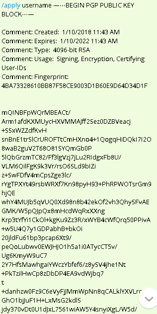

## gai - a guld artificial inteligence Telegram bot.

You can now Interact with the guld network and use the guld ledger to send and recieve guld.

1. [Join our guld Telegram Group and see what gai, the guld A.I. can do for you](https://t.me/guldcoin) 

2. [Download and install Telegram on your computer if you haven't.](https://telegram.org/) 


3. [Join the Guld Support - Telegram Group available for help here.](https://t.me/joinchat/EKTIchEMTw-lRYBFNbumnA)


## Getting Started

1. You will need to have a computer with PGP installed in it. Follow these instructions on how to install for [Linux](http://guld.email/2-installation/2-Linux.html), [MacOS](http://guld.email/2-installation/3-MacOS.html), or your [Windows](http://guld.email/2-installation/4-Windows.html) computer.

2. Join the [Guld Telegram Group by clicking here.](https://t.me/guldcoin)

3. Once you're there, go into the user list and look for the profile under the name `gai`. Click on it, and you can start talking to him through private messages, or in any telegram group where he has been invited.  [Guld Telegram Support Is also available for your setup needs.](https://t.me/joinchat/EKTIchEMTw-lRYBFNbumnA) 

4. You will need to [Export your Public Key in a text block, and create signed transactions into a text block](http://guld.chat/4-FAQ.html)

## Gai's Commands

Gai will help you check crypto prices, apply for a guld username, register your personal or organization's guld account, send and receive payments and much more! 


#### Help

Type `/help` to say hi! - This is how you start a conversation with gai. He will provide a list of all the available options of interacting with the guld network.

The `/help` command presents you with the list of available commands to use with gai.


#### [Price](http://guld.chat/3-transactions/3-Transfers.html)

gai can provide real time prices for various Crypto Currencies like Guld, Bitcoin, Dash, and Ethereum. Guld is the default price.

Type `/price` followed by the crypto currency  name (GULD - Default, BTC, DASH, ETH) for gai to provide the latest price of your selected coin.


#### [Applying on our Telegram group](http://guld.chat/3-transactions/1-Application.html)

You can Apply for your guld username by sending the `/apply` command to gai, followed by your requested username and your public pgp key in text form.



This ties up your PGP key to your Guld Username.

Your application will be reviewed and if approved, [You must submit a registration transaction to gai to finalize your membership.]

Once your application request has been accepted, [you will need to sign your registration transaction.](http://guld.chat/3-transactions/2-Registration.html)


#### [Registration](http://guld.chat/3-transactions/2-Registration.html)

Once your application has been approved by a guld member, you may [sign your registration transaction.](http://guld.chat/3-transactions/2-Registration.html) 

[Look at these tips for help on how to sign.](http://guld.chat/4-FAQ.html)


#### [Sending guld and checking balance](http://guld.chat/3-transactions/3-Transfers.html) 

Gai is also your personal bank teller.

You can request a "digital transaction slip" to sign, then submit to him, and he will register the transaction on your behalf to the guld ledger.

Sending a signed message to gai preceded by the command `/sub` will register a transaction into the guld ledger.

using the command `/send`, gai produces the ledger transaction format, that when signed, is recognized as a valid order from the signer.

The command `/send fromusername tousername 5` will produce the following transaction:

``` 
 2018/03/06 * transfer
    ; timestamp: 1520395322
    fromusername:Assets   -5 GULD
    fromusername:Expenses   5 GULD
    tousername:Assets   5 GULD
    tousername:Income   -5 GULD
``` 

Signing will produce a file that looks like the text below, that when sent with the `/sub` command, will be recorded by gai into the guld network.

``` 
/sub -----BEGIN PGP SIGNED MESSAGE-----
Hash: SHA256

2018/03/06 * transfer
    ; timestamp: 1520395322
    fromusername:Assets   -5 GULD
    fromusername:Expenses   5 GULD
    tousername:Assets   5 GULD
    tousername:Income   -5 GULD
-----BEGIN PGP SIGNATURE-----

iQEzBAEBCAAdFiEEflQyPEoSv2olnyuG+mKOtSEPRCcFAlqfHl0ACgkQ+mKOtSEP
RCe2xwf9FlVoln3YHGQXhoVu1ipepzAdgFzNVICLozKAFlC6ky6jwik7VIg//FxG
VnSvoR0DzuGxD21lP/jdW0sOJZnObiV5oAzjeJcci90BTMZVMnBS2yZlImQms3c4
4u6m6CtaviJB9+3+5C/9wvTH2Gf8gAhlnGCurvCPMdR7h7zfn8LyTEhTcfE1nXxU
0btMdnkYzbIau0Kljbc0/1siG+16wChriQPY6BHLGKqhzHoHyKii95VXV4WoZbXt
cFsg38qHUkQFtmwJ9aqtXdjaxM+GphGT8k1WkWfK5e6pLuB2o+PJnQmiBPSlv8zx
wqYfSs5XxDJoawVUQcwfZaalXuKSVw==
=ZE4h
-----END PGP SIGNATURE-----

```


#### [Grants for work provided to guld](http://guld.chat/3-transactions/4-Grants.html)

If you provide services to the guld network, [follow the instructions here to receive your payment](http://guld.chat/3-transactions/4-Grants.html)

A request for work must be issued by `isysd` and approved by him for the guld coins to be produced through the grant.

This is the basis of the guld meritocracy.


#### More Questions

If you have any questions: [Join the Guld Support Telegram Group - Our support team will gladly help you out!](https://t.me/joinchat/EKTIchEMTw-lRYBFNbumnA)
