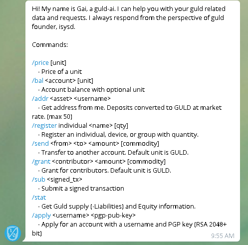

# guld.chat - A telegram ai interface for guld.

## gai - a guld artificial inteligence Telegram bot.

Gai is the newest, easiest way to interact, transact, and use the guld blocktree.

### Type `/help` to say hi!

The `/help` command presents you with the list of available commands to use with gai.

###  [Download Telegram](https://telegram.org/) To interact with Gai. 

 Telegram, the bot enabled chat app is the easiest way to interact with the guld network. 
 
 Gai will help you apply for a username, register your personal or organization's account, send and receive payments and also grants for work provided to the guld network meritocracy!

### [Set up your PGP Identity for signing and encrypting](http://guld.chat/4-FAQ.html)
 
Your identity in the guld network is tied up to a digital key that only you control. This is called a PGP key.

[You can read more about setting up your PGP Key with for Telegram, by going to guld.chat](http://guld.chat/4-FAQ)
 
Once you've created your PGP identity, and have located your public key, you can apply for a guld username. 
 

### [Apply for your guld id on our Telegram group](http://guld.chat/3-transactions/1-Application.html)

Tying up your PGP key to your Guld Username on our [Telegram Group](https://t.me/guldcoin)

[Join the `Guld` group and follow the instructions here to apply for your guld username.](https://t.me/guldcoin)

Once you're in the group, send `gai` a friendly message with your application request!

Once your application request has been accepted, [you will need to sign your registration transaction.](email.chat/3-transactions/2-Registration.html)

### Setting up your guld Identity.

Now that your application has been approved by a guld member, you may [sign your registration transaction.](http://guld.chat/3-transactions/2-Registration.html) 

The price for registration is currently 1 guld.

)

 
hover your mouse over your email in the list in pgpsuite

### Checking Price, balance and sending guld

Gai can also help you with your financial tasks!
 
Get the dollar price for cryptos with the `/price` command followed by BTC, ETH, DASH or GULD. Leave empty for guld. 

Find your Dollar balance by replacing your name in the `/bal username $` command, or guld if sent without the dollar sign

### [Sending guld with gai](http://guld.chat/3-transactions/3-Transfers.html)

Gai is also your personal bank teller.

you can request a `transaction slip` to sign, then submit to him, and he will register the transaction on your behalf to the guld ledger.

`/send from to 5`, for example will produce the following text, which you can sign to autorize, and then submit the text of the signed transaction to gai.

### Work Grants through Gai.

If you provide services to the guld network, [follow the instructions here to recieve](http://guld.chat/3-transactions/4-Grants.html)

